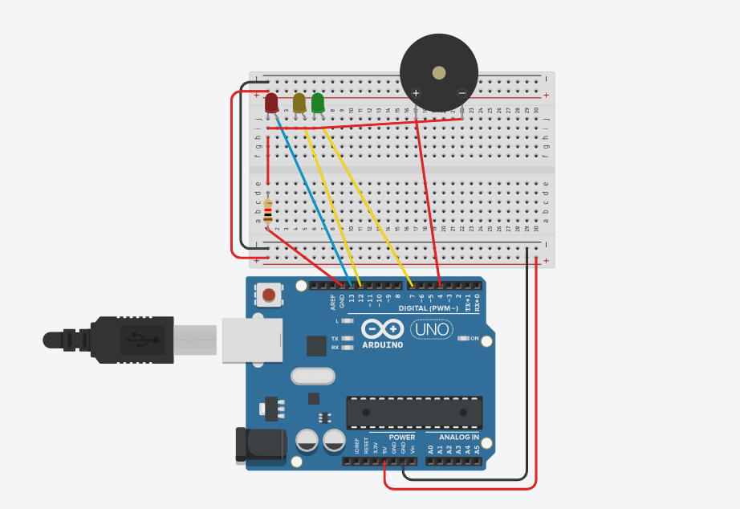

# Arduino LED Lalu Lintas

Proyek ini adalah simulasi lampu lalu lintas menggunakan Arduino dengan LED dan buzzer. Sistem ini meniru siklus lampu lalu lintas standar dengan lampu merah, kuning, dan hijau, serta suara beep pada transisi kuning.

## Pin Konfigurasi

| Komponen   | Pin |
|------------|-----|
| LED Merah  | 13  |
| LED Kuning | 12  |
| LED Hijau  | 7   |
| Buzzer     | 4   |

## Komponen

## Skematik

## Breadboard Diagram

